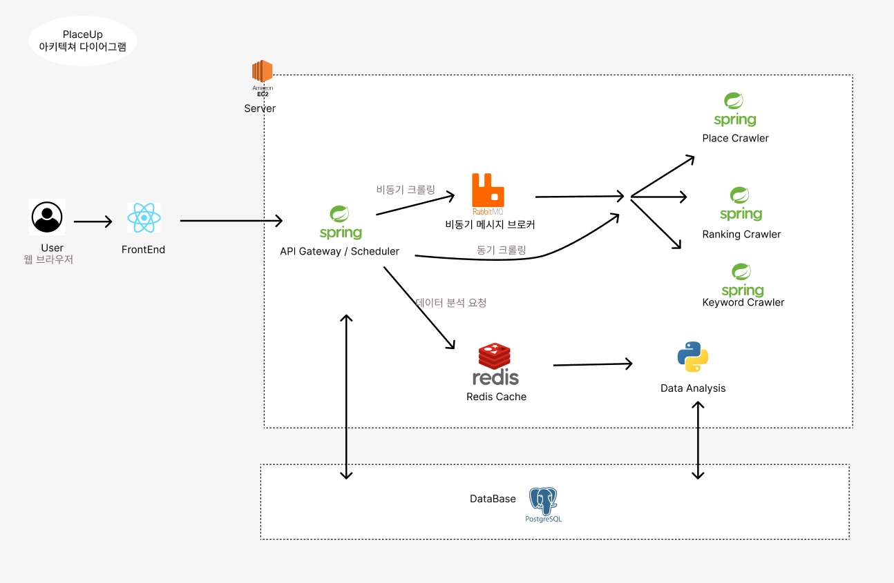
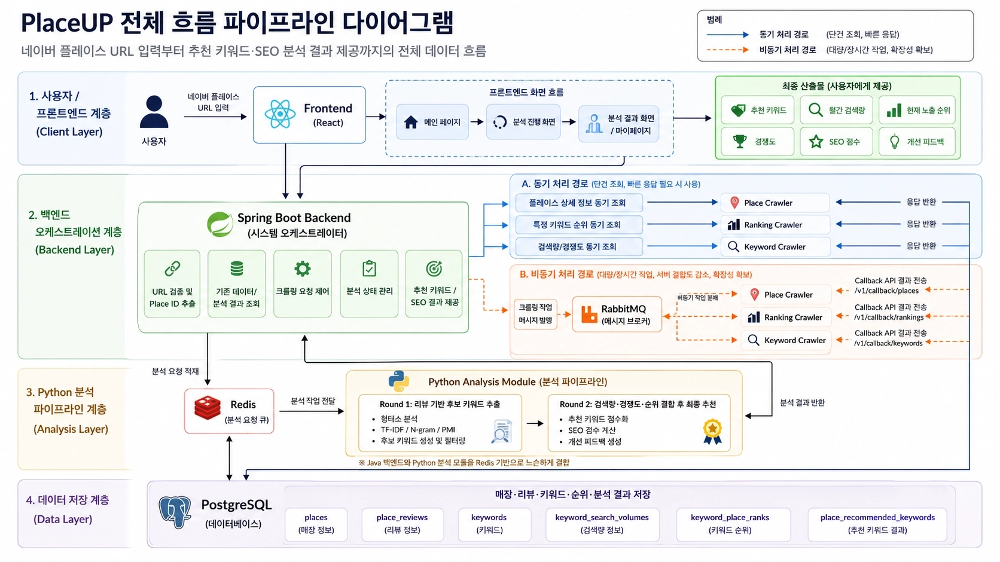
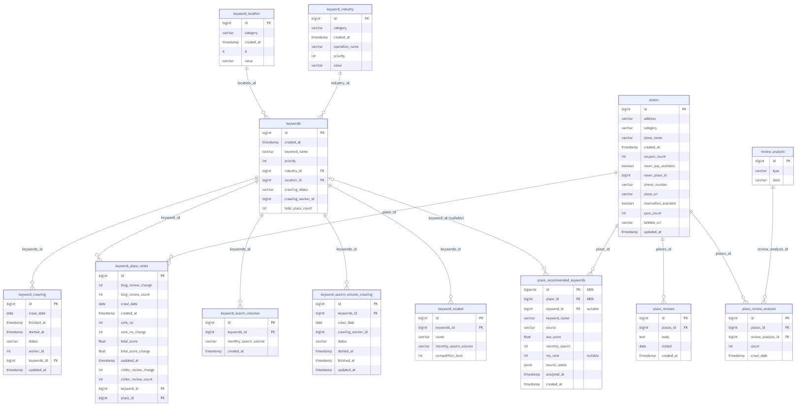

# 🔍 PlaceUP

> 네이버 플레이스 키워드 추천 및 분석 서비스

자영업자가 네이버 플레이스 검색 상위 노출을 위한 최적 키워드를 추천받고,  
SEO 점수와 피드백을 통해 플레이스 관리 전략을 수립할 수 있도록 지원합니다.

---

## 📋 Table of Contents

- [Demo](#-demo)
- [Project Deliverables](#-project-deliverables)
- [System Architecture](#-system-architecture)
- [ERD](#-erd)
- [Tech Stack](#-tech-stack)
- [Team Members](#-team-members)

---

## 🎥 Demo

> 추후 추가 예정

---

## 📁 Project Deliverables

| 구분 | 파일 | 설명 |
|------|------|------|
| 발표자료 | [PlaceUP 발표자료](docs/PlaceUP_발표자료.pdf) | 프로젝트 발표용 자료 |
| 프로젝트 결과 보고서 | [PlaceUP 결과보고서](docs/PlaceUP_결과보고서.pdf) | 프로젝트 최종 결과 보고서 |

---

## 🛠 System Architecture

### PlaceUP 아키텍처 다이어그램

### PlaceUP 시스템 아키텍처

---

## 🔑 ERD

---

## 💻 Tech Stack

### 🎨 설계 및 디자인

| 항목 | 기술 스택 | 상세 용도 |
|------|-----------|-----------|
| UI/UX 디자인 | Figma | 와이어프레임 및 프로토타이핑 |
| DB 설계 | ERDCloud | ERD 작성 및 테이블 관계 설계 |
| 아키텍처 설계 | Lucidchart | 시스템 아키텍처 다이어그램 작성 |

### 🔍 프론트엔드

| 항목 | 기술 스택 | 상세 용도 |
|------|-----------|-----------|
| 웹 프레임워크 | React | 컴포넌트 기반 사용자 인터페이스 구축 |
| UI 스타일링 | CSS | 스타일링 |
| 시각화 | Chart.js, react-worldcloud | 분석 결과 데이터 시각화 |
| HTTP 통신 | Axios | 백엔드 REST API 비동기 요청 및 응답 처리 |

### 🖥️ 백엔드

| 항목 | 기술 스택 | 상세 용도 |
|------|-----------|-----------|
| API / 비즈니스 로직 | Spring Boot 3.4.10 (Java 21) | 메인 서버 — API Gateway, 비즈니스 로직 |
| 스케줄러 | Spring Boot 3.4.10 (Java 21) | 주기적 키워드 순위·검색량 자동 수집 |
| 데이터 수집 | Spring Boot 3.4.10 (Java 21) | Place · Ranking · Keyword 크롤러 |
| ORM | Spring Data JPA, QueryDSL 5.0 | 엔티티 매핑, 동적 쿼리 생성 |
| 비동기 메시징 | RabbitMQ, Spring AMQP | 백엔드 ↔ 크롤러 비동기 작업 분배 |
| 캐시 / 작업 큐 | Redis Streams | Spring Boot ↔ Python 분석 모듈 중계 |
| HTML 파싱 | Jsoup 1.17.2 | 네이버 플레이스 페이지 HTML 파싱 |
| 모니터링 | Actuator, Prometheus | 헬스 체크 및 메트릭 수집 |

### 📚 데이터 분석

| 항목 | 기술 스택 | 상세 용도 |
|------|-----------|-----------|
| 데이터 처리 | pandas, numpy | 수집 데이터 정제 및 분석용 매트릭스 연산 |
| 자연어 처리 (NLP) | KoNLPy (Okt) | 텍스트 데이터 형태소 분석 및 전처리 |
| 감성 분석 | KcBERT/HuggingFace |  사용자 리뷰/텍스트 기반 감정 분류 딥러닝 모델 |
| 의미 유사도 | SentenceTransformers (KR-SBERT) | 사전 미등재 단어 유사도 기반 의미 태그 매핑 |

### 📶 데이터베이스

| 항목 | 기술 스택 | 상세 용도 |
|------|-----------|-----------|
| DBMS | PostgreSQL | 관계형 데이터베이스 정형 데이터 관리 |

### 🌐 배포

| 항목 | 기술 스택 | 상세 용도 |
|------|-----------|-----------|
| 컨테이너화 | Docker, Docker Compose | 서비스 컨테이너화 및 멀티 서버 연결 |
| 클라우드 서버 | AWS EC2, RDS | 서버 인스턴스 호스팅 및 PostgreSQL 운영 |
| 웹 서버 | Nginx | 리버스 프록시 및 정적 파일 서빙 |

---

## 👨‍👩‍👧‍👦 Team Members

| 이름 | 포지션 | GitHub |
|------|--------|--------|
| 이하현 | 팀장, 백엔드 | [@hahyunnii](https://github.com/hahyunnii) |
| 윤혜준 | 프론트엔드 | [@ggony516](https://github.com/ggony516) |
| 노승아 | 데이터 분석 | [@nossing](https://github.com/nossing) |
| 심수민 | 데이터 분석 | [@SuminTH](https://github.com/SuminTH) |
